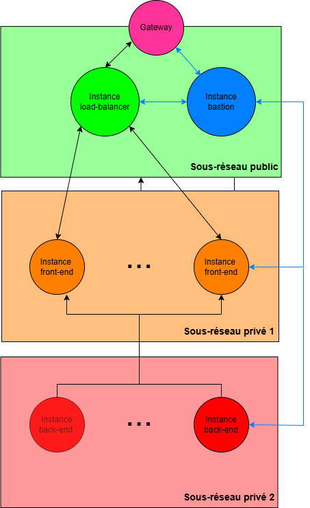

# Architecture Cloud pour Streaming Vidéo (AWS)

## Projet associé à l'UE GIN-208 Télécom Paris

**Objectif :** se familiariser avec les concepts de l’Infrastructure As Code en utilisant Terraform et AWS pour créer et gérer l’ensemble des ressources cloud nécessaires, tout en utilisant Ansible pour automatiser la configuration des serveurs, déployer les services et orchestrer le fonctionnement global de l’infrastructure.

**Tâche à réaliser :** concevoir et déployer une infrastructure cloud robuste, suivant les bonnes pratiques, capable de fournir un service de streaming vidéo en temps réel. L’objectif est de reproduire le fonctionnement d’une diffusion en direct, comme celle d’un match de football, depuis la capture du flux jusqu’à sa diffusion aux utilisateurs.

> Remarque : Pour ce projet, l'utilisation de certains services AWS nous a été défendue (pour des raisons de coût). Il peut donc vous sembler que certaines solutions mises en œuvre ne sont pas les plus pertinentes. A titre d'exemple le load balancing aurait pu être exécuté par le service managé d'AWS : Elastic Load Balancer.

## Architecture



### Description de l’architecture

L’infrastructure déployée repose sur **trois sous-réseaux** distincts à l’intérieur d’un même **VPC AWS** :

*   **Un sous-réseau public**, qui héberge le \*\*bastion \*\* et le **load balancer**.
*   **Un sous-réseau privé**, pour les **serveurs front-end** (chargés de diffuser le flux vidéo aux clients)
*   **Un sous-réseau privé**,  pour les **serveurs back-end** (responsables de la génération et de l’envoi des flux RTMP).

Le **bastion** sert de point d’entrée unique pour accéder en SSH à toutes les instances (utilisé pour la configuration via Ansible). Il agit également comme **passerelle de routage**, permettant aux instances privées d’accéder à Internet si nécessaire (téléchargement de libraire par exemple).

Le **load balancer**, quant à lui, est chargé de distribuer le trafic entrant (HTTP/HTTPS) vers les serveurs front-end. Il gère aussi le chiffrement des connexions grâce à un certificat SSL délivré par **Let’s Encrypt**.

Les **serveurs front-end** exécutent **Nginx avec le module RTMP** et sont responsables de la réception, du transcodage et de la mise à disposition du flux vidéo via les protocoles **HLS** et **DASH**, rendant ainsi la lecture possible depuis un navigateur.

Les **serveurs back-end** utilisent **FFmpeg** pour simuler une source vidéo en direct. Ils envoient en continu un flux RTMP vers les serveurs front-end, qui se chargent ensuite de la diffusion.

## Structure du projet

```
├── terraform/
│   ├── main.tf
│   ├── network.tf
│   ├── keys.tf
│   ├── loadbalancer.tf
│   └── ...
│
├── ansible/
│   ├── inventory.ini (fichier généré après terraform apply)
│   ├── playbook.yaml
│   └── roles/
│       ├── loadbalancer/
│       │   ├── tasks/
│       │   │   └── main.yaml
│       │   │   └── loadbalancer.conf (fichier généré après terraform apply)
│       ├── server-back/
│       │   └── tasks/
│       │       └── main.yaml (fichier généré après terraform apply)
│       ├─ server-front/
│       │    └── tasks/
│       │        └── ...
│       └── bastion/
│           └── tasks/
│               └── main.yaml
│
├── assets/   (fichier illustration readme)
│
└── README.md
```

*   Le dossier /terrafrom contient tous les fichiers nécessaires à la création de l’infrastructure sur AWS, Terraform automatise la création, la configuration réseau et la génération des fichiers nécessaires à Ansible.
*   Le dossier /ansible contient tous les fichiers de configurations logicielles des instances AWS.

> ##### Remarque : Ce dépôt ne contient pas les fichiers automatiquement générés comme _terraform.tfstate ou .tfstate.backup._ Il ne contient pas également le dossier environnement _ansible._ Ainsi le dépot n'a pas pour objectif de fournir un code directement exécutable.

## Suggestion pour aller plus loin

*   **Auto-scalling** au niveau de notre architecture pour assurer la continuité du service quelque soit la charge.
*   Mettre en place un pipeline **CI/CD** pour le déploiement automatique.
*   **Surveillance** et **Observabilité** pour faire remonter des mesures de performance.
